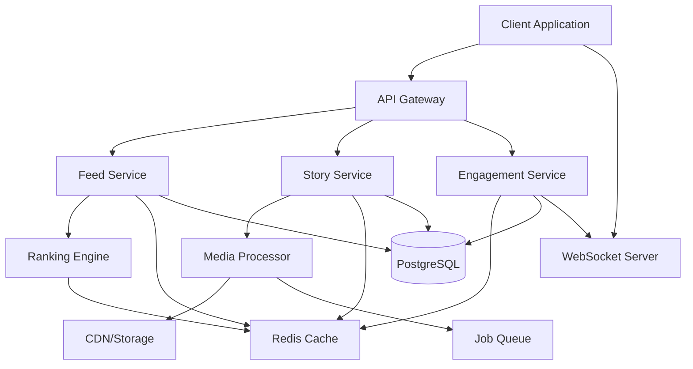

# Design Document

## Overview

The Content Feed & Timeline system is a comprehensive social content platform featuring two primary components: a personalized feed system with intelligent ranking, and an ephemeral Stories feature. The design emphasizes performance, real-time updates, and user engagement while maintaining scalability for high-traffic scenarios.

### Key Design Principles

- **Performance First**: Virtualized rendering, aggressive caching, and optimized queries
- **Real-Time Experience**: WebSocket integration for live updates and engagement
- **Modular Architecture**: Separate concerns for feed, stories, and engagement systems
- **Progressive Enhancement**: Core functionality works without JavaScript, enhanced with real-time features
- **Mobile-First**: Optimized for mobile devices with responsive design patterns

## Architecture

### System Components



### Technology Stack

- **Frontend**: Next.js 14 with App Router, React Server Components
- **Backend**: Next.js API Routes with server actions
- **Database**: PostgreSQL with Prisma ORM
- **Caching**: Redis for hot data and computed scores
- **Real-Time**: WebSocket (Socket.io or native WebSocket API)
- **Media Storage**: Cloud storage (AWS S3/CloudFront or similar)
- **Job Queue**: Bull/BullMQ for async processing
- **Image Processing**: Sharp for server-side, native Canvas API for client

## Components and Interfaces

### Feed System Components

#### FeedController

Handles feed requests and orchestrates data fetching.

```typescript
interface FeedController {
  getFeed(userId: string, options: FeedOptions): Promise<FeedResponse>;
  getExploreFeed(userId: string, options: FeedOptions): Promise<FeedResponse>;
  getFollowingFeed(userId: string, options: FeedOptions): Promise<FeedResponse>;
  refreshFeed(userId: string): Promise<void>;
}

interface FeedOptions {
  type: 'home' | 'explore' | 'following' | 'local' | 'my-pets';
  limit: number;
  cursor?: string;
  filters?: FeedFilters;
}

interface FeedFilters {
  contentTypes?: ('photo' | 'video' | 'text' | 'poll')[];
  dateRange?: { start: Date; end: Date };
  topics?: string[];
  petIds?: string[];
  highQualityOnly?: boolean;
}

interface FeedResponse {
  posts: Post[];
  nextCursor?: string;
  hasMore: boolean;
}
```

#### RankingEngine

Computes relevance scores for feed posts.

```typescript
interface RankingEngine {
  computeScore(post: Post, user: User, context: RankingContext): number;
  batchComputeScores(posts: Post[], user: User): Map<string, number>;
  getAffinityScore(userId: string, authorId: string): Promise<number>;
}

interface RankingContext {
  userPreferences: UserPreferences;
  recentInteractions: Interaction[];
  followingGraph: FollowingGraph;
}

interface RankingSignals {
  engagementScore: number;
  recencyMultiplier: number;
  affinityBoost: number;
  contentTypeBoost: number;
  topicRelevance: number;
  diversityPenalty: number;
}
```

#### PostComposer

Client-side component for creating posts.

```typescript
interface PostComposer {
  content: string;
  media: MediaAttachment[];
  petTags: string[];
  location?: Location;
  visibility: VisibilityLevel;
  pollOptions?: PollOption[];
  scheduledAt?: Date;
}

interface MediaAttachment {
  id: string;
  type: 'photo' | 'video' | 'gif';
  url: string;
  thumbnail: string;
  caption?: string;
  order: number;
}
```

### Story System Components

#### StoryCamera

Handles story capture and editing.

```typescript
interface StoryCamera {
  capturePhoto(): Promise<Blob>;
  recordVideo(maxDuration: number): Promise<Blob>;
  applyFilter(media: Blob, filter: Filter): Promise<Blob>;
  addSticker(sticker: Sticker): void;
  addText(text: TextOverlay): void;
  enableDrawing(tool: DrawingTool): void;
}

interface Sticker {
  type: 'emoji' | 'gif' | 'location' | 'mention' | 'poll' | 'question' | 'countdown' | 'music' | 'quiz';
  position: { x: number; y: number };
  size: number;
  rotation: number;
  content: any; // Type-specific content
}

interface TextOverlay {
  text: string;
  font: string;
  color: string;
  backgroundColor?: string;
  position: { x: number; y: number };
  size: number;
  rotation: number;
  alignment: 'left' | 'center' | 'right';
}
```

#### StoryViewer

Displays stories with auto-advance and interactions.

```typescript
interface StoryViewer {
  currentStory: Story;
  stories: Story[];
  currentIndex: number;
  
  nextStory(): void;
  previousStory(): void;
  pauseStory(): void;
  resumeStory(): void;
  exitViewer(): void;
  handleInteraction(interaction: StoryInteraction): void;
}

interface StoryInteraction {
  type: 'poll_vote' | 'question_response' | 'quiz_answer' | 'reaction' | 'reply';
  data: any;
}
```

### Engagement System Components

#### EngagementTracker

Tracks and processes user interactions.

```typescript
interface EngagementTracker {
  recordLike(postId: string, userId: string, reactionType: ReactionType): Promise<void>;
  recordComment(postId: string, userId: string, comment: Comment): Promise<Comment>;
  recordShare(postId: string, userId: string, shareType: ShareType): Promise<void>;
  recordView(postId: string, userId: string, duration: number): Promise<void>;
  getEngagementStats(postId: string): Promise<EngagementStats>;
}

interface EngagementStats {
  likes: number;
  comments: number;
  shares: number;
  saves: number;
  views: number;
  reactions: Record<ReactionType, number>;
}
```

## Data Models

### Post Model

```typescript
interface Post {
  id: string;
  authorId: string;
  postType: PostType;
  textContent?: string;
  media: MediaItem[];
  petTags: string[];
  mentionedUsers: string[];
  hashtags: string[];
  location?: Location;
  
  // Engagement
  likesCount: number;
  commentsCount: number;
  sharesCount: number;
  savesCount: number;
  viewsCount: number;
  reactions: Record<ReactionType, number>;
  
  // Settings
  visibility: VisibilityLevel;
  visibilityUserIds?: string[];
  commentsEnabled: boolean;
  sharesEnabled: boolean;
  
  // Metadata
  createdAt: Date;
  updatedAt: Date;
  editedAt?: Date;
  deletedAt?: Date;
  scheduledPublishAt?: Date;
  publishedAt?: Date;
  
  // Computed
  relevanceScore: number;
  lastScoreComputedAt?: Date;
}

type PostType = 'standard' | 'photo_album' | 'video' | 'poll' | 'shared' | 'story' | 'live' | 'question' | 'event' | 'marketplace';
type VisibilityLevel = 'public' | 'friends' | 'private' | 'custom' | 'followers_only';
type ReactionType = 'like' | 'love' | 'haha' | 'wow' | 'sad' | 'angry' | 'paw';
```

### Story Model

```typescript
interface Story {
  id: string;
  creatorUserId: string;
  mediaUrl: string;
  mediaType: 'photo' | 'video';
  thumbnailUrl: string;
  mediaDimensions: { width: number; height: number };
  videoDuration?: number;
  
  // Content
  caption?: string;
  stickers: Sticker[];
  musicTrackId?: string;
  linkUrl?: string;
  
  // Visibility
  visibility: 'everyone' | 'close_friends' | 'custom';
  visibilityUserIds?: string[];
  
  // Engagement
  viewsCount: number;
  uniqueViewersCount: number;
  repliesCount: number;
  reactionsCount: number;
  sharesCount: number;
  linkClicksCount: number;
  
  // Lifecycle
  createdAt: Date;
  expiresAt: Date;
  deletedAt?: Date;
  isArchived: boolean;
  archivedAt?: Date;
}
```

### Comment Model

```typescript
interface Comment {
  id: string;
  postId: string;
  authorUserId: string;
  parentCommentId?: string;
  textContent: string;
  mediaUrl?: string;
  mentionedUsers: string[];
  
  likesCount: number;
  repliesCount: number;
  
  createdAt: Date;
  editedAt?: Date;
  deletedAt?: Date;
  isPinned: boolean;
}
```

## Error Handling

### Error Types

```typescript
enum FeedErrorCode {
  FEED_LOAD_FAILED = 'FEED_LOAD_FAILED',
  POST_CREATE_FAILED = 'POST_CREATE_FAILED',
  MEDIA_UPLOAD_FAILED = 'MEDIA_UPLOAD_FAILED',
  INVALID_VISIBILITY = 'INVALID_VISIBILITY',
  RATE_LIMIT_EXCEEDED = 'RATE_LIMIT_EXCEEDED',
  STORY_EXPIRED = 'STORY_EXPIRED',
  STORY_NOT_ACCESSIBLE = 'STORY_NOT_ACCESSIBLE',
  MODERATION_BLOCKED = 'MODERATION_BLOCKED'
}

class FeedError extends Error {
  constructor(
    public code: FeedErrorCode,
    message: string,
    public details?: any
  ) {
    super(message);
  }
}
```

### Error Recovery Strategies

- **Feed Load Failures**: Retry with exponential backoff (3 attempts), fallback to cached feed
- **Media Upload Failures**: Queue for retry, show upload progress, allow user to retry manually
- **Rate Limit Exceeded**: Show user-friendly message with time until reset, queue action for later
- **Story Expiration**: Gracefully handle expired stories, redirect to archive if available
- **Moderation Blocks**: Provide clear feedback, allow appeal process

## Testing Strategy

### Unit Tests

- Ranking algorithm score computation with various input combinations
- Feed filtering logic (muted users, content types, date ranges)
- Story expiration and archiving logic
- Engagement counter updates and cache invalidation
- Media processing and optimization functions

### Integration Tests

- Complete feed loading flow (fetch, rank, filter, return)
- Post creation with media upload and notification dispatch
- Story creation with sticker processing and expiry scheduling
- Real-time engagement updates via WebSocket
- Comment threading and reply notifications

### Performance Tests

- Feed endpoint response time with 1M posts (target: p95 < 200ms)
- Concurrent story viewing by 10K users (WebSocket message delivery < 500ms)
- Media transcoding throughput (1 minute video processed in < 2 minutes)
- Cache hit rates (target: > 80% for feed requests)
- Database query performance with proper index usage

### E2E Tests

- User creates post with multiple media and pet tags
- User views feed, scrolls, and interacts with posts
- User creates story with stickers and publishes to close friends
- Close friend views story, votes in poll, and replies
- Creator views story insights and engagement analytics

## Performance Optimizations

### Caching Strategy

**Feed Caching**
- Individual posts: `post:{postId}` (TTL: 10 minutes)
- User feed: `feed:{userId}:home` (TTL: 5 minutes, stores post IDs only)
- Trending posts: `trending:posts:global` (TTL: 15 minutes)
- Engagement counts: `post:{postId}:counts` (TTL: 1 minute, write-through)

**Story Caching**
- Active stories: `stories:{userId}:active` (TTL: 5 minutes)
- Story feed: `stories:feed:{userId}` (TTL: 2 minutes)
- Story viewers: `story:{storyId}:viewers` (TTL: 1 minute)
- Close friends list: `close_friends:{userId}` (TTL: 1 hour)

### Database Optimization

**Indexes**
- `posts(author_user_id, created_at DESC)`
- `posts(relevance_score DESC)`
- `posts(published_at DESC)`
- `posts USING GIN (hashtags)`
- `stories(creator_user_id, expires_at)` WHERE deleted_at IS NULL
- `post_likes(post_id, created_at DESC)`
- `comments(post_id, created_at DESC)`

**Query Patterns**
- Use read replicas for all feed reads
- Batch fetch author/pet data to avoid N+1 queries
- Denormalize engagement counters for fast reads
- Use cursor-based pagination for infinite scroll

### Media Optimization

**Image Processing**
- Generate multiple sizes: thumbnail (150x267), medium (720x1280), large (1080x1920)
- Use WebP with JPEG fallback
- Progressive JPEG for faster perceived loading
- Strip EXIF data for privacy
- Lazy load with blur-up placeholders

**Video Processing**
- Transcode to multiple qualities: 360p, 480p, 720p, 1080p
- Generate HLS/DASH for adaptive streaming
- Extract thumbnail from first frame
- Compress audio track
- Process asynchronously in background queue

### Real-Time Updates

**WebSocket Channels**
- `feed:{userId}` - New posts and engagement updates
- `post:{postId}` - Live engagement on specific post
- `story:{storyId}:interactions` - Live story interactions
- `user:{userId}:story_views` - Story view notifications

**Message Throttling**
- Batch engagement updates every 5 seconds
- Throttle notifications (first immediate, then batched)
- Debounce typing indicators (500ms)

## Security Considerations

### Content Moderation

- Scan all uploaded media with moderation APIs (AWS Rekognition, Google Vision)
- Auto-flag content with confidence score > 0.8
- Queue flagged content for manual review
- Temporarily hide pending review
- Track repeat offenders for escalating actions

### Privacy Controls

- Respect visibility settings at query level
- Validate user permissions before returning content
- Encrypt sensitive data at rest
- Sanitize user input to prevent XSS
- Rate limit API endpoints (10 posts/hour free, 50/hour premium)

### Data Protection

- Soft delete posts (30-day retention before hard delete)
- Allow users to download their data
- Implement right to be forgotten
- Audit log for sensitive operations
- GDPR compliance for EU users

## Deployment Considerations

### Scalability

- Horizontal scaling for API servers
- Read replicas for database (3+ replicas)
- CDN for media delivery (CloudFront, Cloudflare)
- Redis cluster for distributed caching
- Job queue workers for async processing

### Monitoring

- Track feed load times (p50, p95, p99)
- Monitor cache hit rates
- Alert on error rates > 1%
- Track WebSocket connection counts
- Monitor media processing queue depth

### Rollout Strategy

- Feature flag for gradual rollout
- A/B test ranking algorithm changes
- Canary deployments for API changes
- Monitor metrics during rollout
- Quick rollback capability
