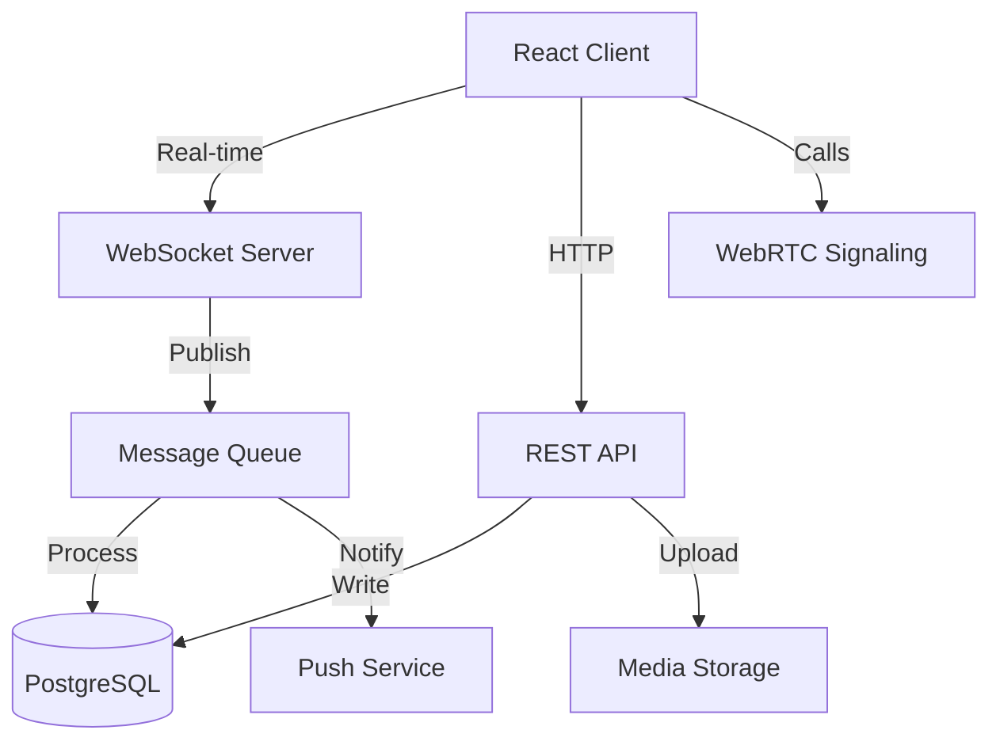

# Direct Messaging System Design

## Overview

The Direct Messaging System provides real-time, feature-rich communication capabilities for the pet social network. The system supports one-on-one conversations, group chats up to 256 participants, rich media sharing, voice/video calls, and advanced messaging features including reactions, replies, editing, and disappearing messages.

**Key Design Principles:**
- **Real-time First**: WebSocket-based architecture for instant message delivery and presence updates
- **Offline Resilience**: Queue-based message sending with automatic retry and conflict resolution
- **Privacy by Design**: Granular privacy controls, message requests, and optional read receipts
- **Performance at Scale**: Cursor-based pagination, lazy loading, and optimistic UI updates
- **Security & Safety**: Spam detection, content moderation, rate limiting, and user blocking

## Architecture

### High-Level Architecture



**Design Rationale:**
- WebSocket connections provide sub-second message delivery and typing indicators
- REST API handles CRUD operations, media uploads, and non-real-time features
- Message queue decouples write operations from real-time delivery for reliability
- Separate media storage optimizes for large file handling and CDN distribution
- WebRTC signaling server coordinates peer-to-peer voice/video connections

### Technology Stack

- **Frontend**: React with TypeScript, Zustand for state management, Socket.io client
- **Backend**: Next.js API routes, Socket.io server, Prisma ORM
- **Database**: PostgreSQL with full-text search and JSONB for flexible metadata
- **Media Storage**: S3-compatible storage with CloudFront CDN
- **Real-time**: Socket.io for WebSocket connections with fallback to long-polling
- **Calls**: WebRTC with STUN/TURN servers for NAT traversal
- **Push**: Firebase Cloud Messaging (FCM) for Android, APNs for iOS
- **Queue**: BullMQ with Redis for background job processing

## Components and Interfaces

### 1. Message Inbox Component

**Purpose**: Display all conversations sorted by recent activity with unread indicators

**Key Features:**
- Virtual scrolling for 1000+ conversations
- Swipe gestures for quick actions (mark unread, delete, archive, mute)
- Real-time updates via WebSocket subscription
- Pinned conversations always at top
- Search and filter capabilities

**State Management:**
```typescript
interface InboxState {
  conversations: Conversation[]
  unreadCount: number
  selectedConversationId: string | null
  filter: 'all' | 'unread' | 'archived' | 'requests'
  searchQuery: string
}
```

**API Endpoints:**
- `GET /api/messages/conversations` - Fetch conversations with pagination
- `PATCH /api/messages/conversations/:id` - Update conversation (pin, mute, archive)
- `DELETE /api/messages/conversations/:id` - Delete conversation

### 2. Chat Thread Component

**Purpose**: Display messages in a conversation with real-time updates

**Key Features:**
- Infinite scroll with cursor-based pagination (50 messages per page)
- Optimistic UI updates for sent messages
- Message grouping by sender and time
- Lazy loading for media thumbnails
- Jump-to-message from search results
- Auto-scroll to bottom on new messages (if already at bottom)

**Message Rendering:**
- Text messages with link detection and @mention highlighting
- Media messages with progressive loading (thumbnail → full resolution)
- Voice messages with waveform visualization and playback controls
- Replied messages with quoted content preview
- System messages for calls, member changes, settings updates

**WebSocket Events:**
```typescript
// Incoming events
socket.on('message:new', (message: Message) => void)
socket.on('message:updated', (message: Message) => void)
socket.on('message:deleted', (messageId: string) => void)
socket.on('message:reaction', (reaction: Reaction) => void)
socket.on('typing:start', (userId: string) => void)
socket.on('typing:stop', (userId: string) => void)
socket.on('message:read', (messageId: string, userId: string) => void)

// Outgoing events
socket.emit('typing:start', { conversationId: string })
socket.emit('typing:stop', { conversationId: string })
socket.emit('message:read', { messageId: string })
```

### 3. Message Composer Component

**Purpose**: Input interface for creating and sending messages

**Key Features:**
- Auto-expanding textarea (1-5 lines)
- @mention autocomplete with member search
- Media picker with multi-select (up to 10 items)
- Voice recording with waveform visualization
- Reply/edit mode with quoted message preview
- Draft auto-save every 2 seconds
- Send button with long-press for schedule option

**Media Upload Flow:**
1. User selects media → Show thumbnails in composer
2. User taps send → Start upload with progress indicators
3. Upload completes → Send message with media URLs
4. On failure → Show retry button, keep media in composer

**Design Rationale**: Upload before sending ensures media is available when message is delivered, avoiding broken media references.

### 4. Group Chat Management Component

**Purpose**: Create and manage group conversations

**Key Features:**
- Member selection with search and multi-select
- Group settings (name, icon, description, permissions)
- Member list with role badges (admin, member)
- Add/remove members with confirmation
- Leave group with warning if last admin
- Group info panel with media gallery

**Permission Levels:**
```typescript
enum GroupPermission {
  SEND_MESSAGES = 'send_messages',      // Who can send messages
  ADD_MEMBERS = 'add_members',          // Who can add new members
  REMOVE_MEMBERS = 'remove_members',    // Who can remove members
  CHANGE_SETTINGS = 'change_settings',  // Who can modify group settings
  DELETE_MESSAGES = 'delete_messages'   // Who can delete any message
}

interface GroupSettings {
  whoCanSendMessages: 'everyone' | 'admins_only'
  whoCanAddMembers: 'everyone' | 'admins_only'
  maxMembers: number // Default 256
}
```

### 5. Voice/Video Call Component

**Purpose**: Real-time audio and video communication

**Key Features:**
- WebRTC peer-to-peer connections with STUN/TURN fallback
- Call UI with mute, speaker, camera controls
- Picture-in-picture mode for video calls
- Screen sharing capability
- Call quality indicators (network strength, latency)
- Call history in chat thread

**Call Flow:**
1. Caller initiates → Send signaling message via WebSocket
2. Recipient receives → Show incoming call UI with ringtone
3. Recipient accepts → Exchange ICE candidates and establish WebRTC connection
4. Call active → Stream audio/video with quality adaptation
5. Call ends → Save call record to database, show system message

**Design Rationale**: WebRTC provides low-latency peer-to-peer connections. Signaling via WebSocket ensures call setup works even if one peer is behind NAT.

### 6. Message Request System

**Purpose**: Filter messages from non-followers to prevent spam

**Key Features:**
- Separate inbox for message requests
- No notifications for requests (spam prevention)
- Preview without marking as read
- Accept/decline actions
- Privacy settings integration

**Privacy Settings:**
```typescript
enum MessagePrivacy {
  EVERYONE = 'everyone',           // Anyone can message
  FRIENDS = 'friends',             // Only mutual followers
  FOLLOWING = 'following',         // Only people I follow
  NO_ONE = 'no_one'               // Disable DMs entirely
}
```

**Request Logic:**
- If sender is follower → Deliver to main inbox
- If sender is not follower AND privacy allows → Create message request
- If sender is blocked/restricted → Reject silently
- If sender is rate-limited → Reject with error

### 7. Spam Detection & Moderation

**Purpose**: Protect users from spam, harassment, and inappropriate content

**Key Features:**
- Rate limiting (50 messages/hour from non-followers, 10 new conversations/day)
- Pattern-based spam detection (repeated messages, suspicious links)
- Content moderation for media (NSFW detection)
- User reporting with moderation queue
- Automatic actions for repeat offenders

**Spam Detection Pipeline:**
```typescript
interface SpamCheckResult {
  isSpam: boolean
  confidence: number
  reasons: string[]
  action: 'allow' | 'filter' | 'block'
}

async function checkSpam(message: Message): Promise<SpamCheckResult> {
  // 1. Check rate limits
  // 2. Scan for spam patterns (repeated text, excessive links)
  // 3. Check sender reputation score
  // 4. Verify links against safe browsing API
  // 5. Scan media for inappropriate content
  // 6. Return combined result
}
```

**Design Rationale**: Multi-layered approach catches different spam types. Rate limiting prevents bulk spam, pattern detection catches automated bots, and content scanning protects from harmful media.

## Data Models

### Core Models

```prisma
model Conversation {
  id                String   @id @default(cuid())
  type              ConversationType // 'direct' | 'group'
  createdAt         DateTime @default(now())
  updatedAt         DateTime @updatedAt
  
  // Group-specific fields
  name              String?
  description       String?
  iconUrl           String?
  settings          Json?    // GroupSettings
  
  // Relationships
  participants      ConversationParticipant[]
  messages          Message[]
  
  @@index([updatedAt])
}

model ConversationParticipant {
  id              String   @id @default(cuid())
  conversationId  String
  userId          String
  role            ParticipantRole // 'admin' | 'member'
  joinedAt        DateTime @default(now())
  lastReadAt      DateTime?
  
  // Settings
  isMuted         Boolean  @default(false)
  mutedUntil      DateTime?
  isPinned        Boolean  @default(false)
  isArchived      Boolean  @default(false)
  
  // Relationships
  conversation    Conversation @relation(fields: [conversationId], references: [id], onDelete: Cascade)
  user            User @relation(fields: [userId], references: [id], onDelete: Cascade)
  
  @@unique([conversationId, userId])
  @@index([userId, updatedAt])
}

model Message {
  id              String   @id @default(cuid())
  conversationId  String
  senderId        String
  content         String?  @db.Text
  type            MessageType // 'text' | 'media' | 'voice' | 'system' | 'poll'
  metadata        Json?    // Media URLs, voice duration, poll data, etc.
  
  // Message features
  replyToId       String?
  isEdited        Boolean  @default(false)
  editHistory     Json?    // Array of {content, editedAt}
  isForwarded     Boolean  @default(false)
  forwardCount    Int      @default(0)
  
  // Disappearing messages
  expiresAt       DateTime?
  
  // Status tracking
  status          MessageStatus // 'sending' | 'sent' | 'delivered' | 'failed'
  createdAt       DateTime @default(now())
  updatedAt       DateTime @updatedAt
  deletedAt       DateTime?
  deletedForEveryone Boolean @default(false)
  
  // Relationships
  conversation    Conversation @relation(fields: [conversationId], references: [id], onDelete: Cascade)
  sender          User @relation(fields: [senderId], references: [id], onDelete: Cascade)
  replyTo         Message? @relation("MessageReplies", fields: [replyToId], references: [id])
  replies         Message[] @relation("MessageReplies")
  reactions       MessageReaction[]
  readReceipts    MessageReadReceipt[]
  
  @@index([conversationId, createdAt])
  @@index([senderId])
  @@index([replyToId])
}

model MessageReaction {
  id        String   @id @default(cuid())
  messageId String
  userId    String
  emoji     String   // Unicode emoji
  createdAt DateTime @default(now())
  
  message   Message @relation(fields: [messageId], references: [id], onDelete: Cascade)
  user      User @relation(fields: [userId], references: [id], onDelete: Cascade)
  
  @@unique([messageId, userId, emoji])
  @@index([messageId])
}

model MessageReadReceipt {
  id        String   @id @default(cuid())
  messageId String
  userId    String
  readAt    DateTime @default(now())
  
  message   Message @relation(fields: [messageId], references: [id], onDelete: Cascade)
  user      User @relation(fields: [userId], references: [id], onDelete: Cascade)
  
  @@unique([messageId, userId])
  @@index([messageId])
  @@index([userId])
}

model MessageRequest {
  id              String   @id @default(cuid())
  conversationId  String   @unique
  recipientId     String
  senderId        String
  status          RequestStatus // 'pending' | 'accepted' | 'declined'
  createdAt       DateTime @default(now())
  
  recipient       User @relation("ReceivedRequests", fields: [recipientId], references: [id], onDelete: Cascade)
  sender          User @relation("SentRequests", fields: [senderId], references: [id], onDelete: Cascade)
  
  @@index([recipientId, status])
}

model StarredMessage {
  id        String   @id @default(cuid())
  messageId String
  userId    String
  createdAt DateTime @default(now())
  
  message   Message @relation(fields: [messageId], references: [id], onDelete: Cascade)
  user      User @relation(fields: [userId], references: [id], onDelete: Cascade)
  
  @@unique([messageId, userId])
  @@index([userId])
}

model ScheduledMessage {
  id              String   @id @default(cuid())
  conversationId  String
  senderId        String
  content         String   @db.Text
  metadata        Json?
  scheduledFor    DateTime
  status          ScheduledStatus // 'pending' | 'sent' | 'cancelled'
  createdAt       DateTime @default(now())
  
  sender          User @relation(fields: [senderId], references: [id], onDelete: Cascade)
  
  @@index([scheduledFor, status])
  @@index([senderId])
}

model CallRecord {
  id              String   @id @default(cuid())
  conversationId  String
  initiatorId     String
  type            CallType // 'voice' | 'video'
  status          CallStatus // 'missed' | 'completed' | 'declined'
  duration        Int?     // Seconds
  startedAt       DateTime @default(now())
  endedAt         DateTime?
  
  initiator       User @relation(fields: [initiatorId], references: [id], onDelete: Cascade)
  
  @@index([conversationId])
  @@index([initiatorId])
}

model UserPresence {
  userId          String   @id
  status          PresenceStatus // 'online' | 'offline'
  lastSeenAt      DateTime @default(now())
  updatedAt       DateTime @updatedAt
  
  user            User @relation(fields: [userId], references: [id], onDelete: Cascade)
  
  @@index([status, updatedAt])
}
```

**Design Rationale:**
- `ConversationParticipant` junction table enables per-user settings (mute, pin, archive)
- `Message.metadata` JSONB field provides flexibility for different message types without schema changes
- Soft deletes (`deletedAt`) preserve message history for moderation while hiding from users
- Separate `MessageRequest` table isolates spam filtering logic from main message flow
- `UserPresence` table optimized for frequent updates with minimal data

### Indexes Strategy

**Critical Indexes:**
- `Conversation.updatedAt` - Inbox sorting by recent activity
- `Message(conversationId, createdAt)` - Thread pagination
- `ConversationParticipant(userId, updatedAt)` - User's conversations list
- `MessageReadReceipt(messageId)` - Read status lookups
- `ScheduledMessage(scheduledFor, status)` - Background job processing

**Design Rationale**: Indexes chosen based on query patterns. Composite indexes on (conversationId, createdAt) support efficient pagination. Single-column indexes on foreign keys enable fast joins.

## Error Handling

### Client-Side Error Handling

**Network Errors:**
- WebSocket disconnect → Show "Connecting..." banner, attempt reconnect with exponential backoff
- Message send failure → Mark message as failed, show retry button
- Media upload failure → Keep media in composer, show error toast, allow retry

**Optimistic UI Rollback:**
```typescript
async function sendMessage(content: string) {
  const tempId = generateTempId()
  
  // 1. Optimistically add to UI
  addMessageToUI({ id: tempId, content, status: 'sending' })
  
  try {
    // 2. Send to server
    const message = await api.sendMessage({ content })
    
    // 3. Replace temp message with real message
    replaceMessage(tempId, message)
  } catch (error) {
    // 4. Mark as failed, allow retry
    updateMessageStatus(tempId, 'failed')
  }
}
```

### Server-Side Error Handling

**Validation Errors:**
- Invalid message content → Return 400 with specific error message
- Rate limit exceeded → Return 429 with retry-after header
- Blocked user → Return 403 without revealing block status

**Database Errors:**
- Unique constraint violation → Deduplicate and return existing record
- Foreign key violation → Return 404 for missing conversation/user
- Transaction deadlock → Retry up to 3 times with exponential backoff

**Media Processing Errors:**
- Upload timeout → Return 408, client retries with same file
- Invalid file type → Return 400 with supported formats list
- File too large → Return 413 with size limit

## Testing Strategy

### Unit Tests

**Message Composer:**
- Text input and formatting
- @mention autocomplete logic
- Media selection and preview
- Draft auto-save functionality
- Send button state management

**Message Thread:**
- Message grouping algorithm
- Pagination cursor calculation
- Optimistic UI updates
- Message status transitions
- Scroll position management

**Spam Detection:**
- Rate limiting logic
- Pattern matching algorithms
- Link safety checking
- Content moderation scoring

### Integration Tests

**Message Flow:**
1. User A sends message → Verify stored in database
2. WebSocket broadcasts → Verify User B receives real-time update
3. User B reads message → Verify read receipt sent to User A
4. User A sees read status → Verify UI shows blue checkmarks

**Group Chat:**
1. Create group with 5 members → Verify all receive notifications
2. Send message with @mention → Verify mentioned user gets notification
3. Admin removes member → Verify member loses access
4. Non-admin tries to remove member → Verify permission denied

**Message Requests:**
1. Non-follower sends message → Verify goes to requests folder
2. Recipient accepts request → Verify conversation moves to inbox
3. Recipient declines request → Verify conversation deleted
4. Blocked user sends message → Verify silently rejected

### End-to-End Tests

**Critical User Flows:**
- Send text message and receive reply
- Share photo and view in conversation
- Make voice call and verify call record
- Create group chat and add members
- Edit message within 15-minute window
- Delete message for everyone within 1-hour window
- Report inappropriate message
- Block user and verify no further contact

**Performance Tests:**
- Load conversation with 10,000 messages → Verify <2s initial load
- Send 100 messages rapidly → Verify all delivered in order
- Upload 10 photos simultaneously → Verify progress tracking
- Scroll through 1,000 conversations → Verify smooth 60fps

## Performance Considerations

### Database Optimization

**Query Optimization:**
- Use cursor-based pagination for infinite scroll (avoid OFFSET)
- Fetch only required fields (SELECT specific columns, not *)
- Batch read receipts updates (update multiple in single query)
- Use database-level full-text search for message search

**Caching Strategy:**
- Cache conversation list in Redis (5-minute TTL)
- Cache user presence status (30-second TTL)
- Cache media URLs with CDN (1-year TTL)
- Invalidate cache on writes via pub/sub

### WebSocket Optimization

**Connection Management:**
- Single WebSocket connection per client (multiplex all conversations)
- Heartbeat every 30 seconds to detect dead connections
- Automatic reconnection with exponential backoff (1s, 2s, 4s, 8s, max 30s)
- Subscribe only to active conversation (unsubscribe when switching)

**Message Batching:**
- Batch typing indicators (send max once per second)
- Batch read receipts (send every 2 seconds or on 10 messages read)
- Batch presence updates (send every 30 seconds)

### Media Optimization

**Image Processing:**
- Generate thumbnails (150x150, 300x300, 600x600) on upload
- Compress images to WebP format (80% quality)
- Lazy load full-resolution images (load thumbnail first)
- Progressive JPEG for large images

**Video Processing:**
- Transcode to H.264 MP4 (720p, 30fps)
- Generate thumbnail from first frame
- Stream video with adaptive bitrate (HLS/DASH)
- Limit video duration to 5 minutes, size to 100MB

### Client-Side Optimization

**Rendering Performance:**
- Virtual scrolling for message list (render only visible messages)
- Memoize message components (React.memo)
- Debounce typing indicators (300ms)
- Throttle scroll events (100ms)

**Bundle Size:**
- Code-split call components (load only when needed)
- Lazy load emoji picker (load on first use)
- Use dynamic imports for media viewer
- Tree-shake unused Socket.io features

## Security Considerations

### Authentication & Authorization

**Message Access Control:**
- Verify user is conversation participant before allowing read/write
- Check group admin role before allowing member management
- Validate message ownership before allowing edit/delete
- Enforce privacy settings on message request creation

**API Security:**
- Require authentication token on all endpoints
- Validate CSRF token on state-changing operations
- Rate limit per user (100 requests/minute)
- Sanitize all user input to prevent XSS

### Data Privacy

**Encryption:**
- TLS 1.3 for all client-server communication
- Encrypt media files at rest (AES-256)
- Hash sensitive data in logs (user IDs, message IDs)
- Consider end-to-end encryption for future enhancement

**Data Retention:**
- Delete media files when message is deleted for everyone
- Purge expired disappearing messages via background job
- Anonymize deleted user's messages (replace with "[Deleted User]")
- Export chat history with user consent only

### Content Safety

**Moderation Pipeline:**
1. Client-side: Warn on suspicious links before sending
2. Server-side: Scan text for spam patterns
3. Media upload: Scan images/videos for NSFW content
4. Post-send: User reports trigger manual review
5. Automated: Suspend accounts with multiple violations

**Spam Prevention:**
- Rate limit new conversations (10/day for new accounts)
- Rate limit messages to non-followers (50/hour)
- Limit forwarding (max 5 times per message per user)
- Require phone verification for accounts with spam reports

## Deployment & Monitoring

### Infrastructure

**Scaling Strategy:**
- Horizontal scaling for API servers (stateless)
- Sticky sessions for WebSocket servers (maintain connection)
- Read replicas for database (route read queries)
- CDN for media delivery (CloudFront)
- Redis cluster for caching and pub/sub

**High Availability:**
- Multi-AZ deployment for database (automatic failover)
- Load balancer health checks (remove unhealthy instances)
- Circuit breaker for external services (safe browsing API)
- Graceful degradation (disable non-critical features on overload)

### Monitoring & Alerts

**Key Metrics:**
- Message delivery latency (p50, p95, p99)
- WebSocket connection count and churn rate
- Message send success rate
- Media upload success rate and duration
- Database query performance (slow query log)

**Alerts:**
- Message delivery latency > 5s for 5 minutes
- WebSocket connection failures > 10% for 2 minutes
- Message send failure rate > 5% for 5 minutes
- Database CPU > 80% for 10 minutes
- Media storage > 90% capacity

### Logging

**Structured Logging:**
```typescript
logger.info('message_sent', {
  messageId: message.id,
  conversationId: message.conversationId,
  senderId: message.senderId,
  type: message.type,
  hasMedia: !!message.metadata?.mediaUrls,
  latency: Date.now() - startTime
})
```

**Log Retention:**
- Application logs: 30 days
- Access logs: 90 days
- Audit logs (reports, moderation): 1 year
- Error logs: 90 days with sampling for high-volume errors

## Migration & Rollout Plan

### Phase 1: Core Messaging (Week 1-2)
- Database schema and migrations
- Basic message send/receive via REST API
- Message inbox and thread UI
- Text messages only (no media)

### Phase 2: Real-time Features (Week 3-4)
- WebSocket server setup
- Real-time message delivery
- Typing indicators
- Read receipts
- Online presence

### Phase 3: Rich Media (Week 5-6)
- Media upload and storage
- Image/video messages
- Voice messages
- Media viewer and playback

### Phase 4: Advanced Features (Week 7-8)
- Message reactions
- Reply to messages
- Edit and delete messages
- Message search
- Forward messages

### Phase 5: Group Chats (Week 9-10)
- Group creation and management
- Group settings and permissions
- @mentions in groups
- Group admin controls

### Phase 6: Calls & Polish (Week 11-12)
- Voice/video calls with WebRTC
- Message requests and privacy
- Spam detection and moderation
- Disappearing messages
- Scheduled messages
- Performance optimization

**Rollout Strategy:**
- Beta test with 100 users for 1 week
- Gradual rollout to 10%, 25%, 50%, 100% of users
- Monitor error rates and performance at each stage
- Rollback plan: Feature flag to disable DM system, fall back to old system

## Future Enhancements

**Potential Features:**
- End-to-end encryption for sensitive conversations
- Message translation for international users
- Voice message transcription
- Smart replies (AI-suggested responses)
- Message scheduling with timezone awareness
- Rich link previews with Open Graph metadata
- Collaborative features (shared to-do lists, polls with more options)
- Integration with calendar for scheduling pet playdates
- Bot API for automated messages (appointment reminders, etc.)

