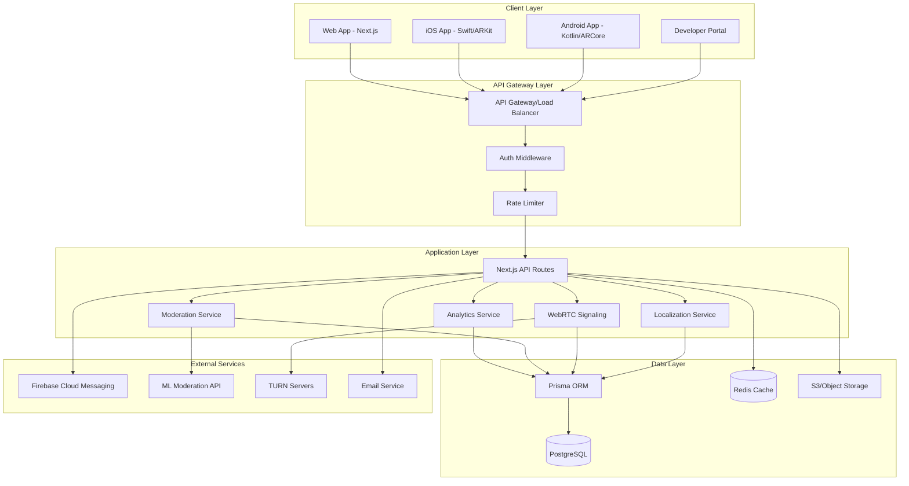

# Design Document

## Overview

This design document outlines the technical architecture and implementation approach for a comprehensive platform enhancement initiative spanning 10 major feature areas. The design emphasizes modularity, scalability, and maintainability while ensuring seamless integration with the existing Next.js/Prisma/PostgreSQL stack.

### Design Principles

1. **Modularity**: Each feature area is designed as an independent module with clear boundaries
2. **API-First**: All features expose well-defined APIs for internal and external consumption
3. **Progressive Enhancement**: Features can be deployed incrementally without breaking existing functionality
4. **Performance**: Optimize for sub-second response times and efficient resource usage
5. **Security**: Implement defense-in-depth with multiple security layers
6. **Observability**: Comprehensive logging, monitoring, and analytics throughout

## Architecture

### High-Level System Architecture




### Technology Stack

**Frontend:**
- Web: Next.js 14+ (App Router), React, TypeScript, Tailwind CSS
- iOS: Swift, SwiftUI, ARKit, AVFoundation
- Android: Kotlin, Jetpack Compose, ARCore, CameraX

**Backend:**
- Runtime: Node.js 20+
- Framework: Next.js API Routes
- ORM: Prisma
- Database: PostgreSQL 15+
- Cache: Redis 7+
- Queue: BullMQ (Redis-based)

**Infrastructure:**
- Storage: AWS S3 or compatible object storage
- CDN: CloudFront or similar
- Push Notifications: Firebase Cloud Messaging
- Real-time: WebRTC with TURN/STUN servers
- Email: SendGrid or AWS SES

**External APIs:**
- Content Moderation: AWS Rekognition + Perspective API (text)
- Translation Management: Lokalise or POEditor (optional)

## Components and Interfaces

### 1. Admin Analytics Dashboard

#### Component Structure

```
app/admin/analytics/
├── page.tsx                 # Main dashboard
├── overview/
│   └── page.tsx            # Overview metrics
├── content/
│   └── page.tsx            # Content metrics
├── moderation/
│   └── page.tsx            # Moderation metrics
└── components/
    ├── MetricCard.tsx      # KPI display
    ├── TimeSeriesChart.tsx # Line/bar charts
    └── ExportButton.tsx    # CSV export
```

#### API Endpoints

```typescript
// GET /api/admin/analytics/overview
interface OverviewMetrics {
  dau: number;
  wau: number;
  mau: number;
  newRegistrations: number;
  churnRate: number;
  activeUsers: number;
  dormantUsers: number;
}

// GET /api/admin/analytics/content
interface ContentMetrics {
  postsPerDay: number;
  commentsPerDay: number;
  avgLikesPerPost: number;
  shareRate: number;
  avgTimeOnPlatform: number;
}

// GET /api/admin/analytics/retention
interface RetentionMetrics {
  d1Retention: number;
  d7Retention: number;
  d30Retention: number;
  cohorts: CohortData[];
}

// GET /api/admin/analytics/moderation
interface ModerationMetrics {
  reportsPerDay: number;
  autoRemovedCount: number;
  moderatorRemovedCount: number;
  avgResolutionTime: number;
}
```

#### Analytics Event Schema

```prisma
model AnalyticsEvent {
  id          String   @id @default(cuid())
  eventType   String   // user_registered, post_created, etc.
  userId      String?
  petId       String?
  metadata    Json?
  timestamp   DateTime @default(now())
  
  @@index([eventType, timestamp])
  @@index([userId, timestamp])
}

model DailyMetrics {
  id                String   @id @default(cuid())
  date              DateTime @unique
  dau               Int
  wau               Int
  mau               Int
  newUsers          Int
  postsCreated      Int
  commentsCreated   Int
  likesAdded        Int
  reportsSubmitted  Int
  
  @@index([date])
}

model CohortRetention {
  id              String   @id @default(cuid())
  cohortMonth     DateTime
  daysSinceSignup Int
  retainedUsers   Int
  totalUsers      Int
  retentionRate   Float
  
  @@unique([cohortMonth, daysSinceSignup])
}
```

#### Aggregation Jobs

```typescript
// lib/analytics/aggregation.ts
export async function aggregateDailyMetrics(date: Date) {
  // Run hourly, aggregate previous hour's events
  const events = await prisma.analyticsEvent.findMany({
    where: {
      timestamp: {
        gte: startOfHour(date),
        lt: endOfHour(date)
      }
    }
  });
  
  // Compute metrics and upsert to DailyMetrics
}

export async function computeRetentionCohorts() {
  // Run nightly, compute D1/D7/D30 retention
  // Group users by signup month
  // Calculate retention for each cohort
}
```


### 2. Multi-Language Support (Localization)

#### Localization Architecture

```
i18n/
├── locales/
│   ├── en.json
│   ├── lt.json
│   ├── ru.json
│   └── de.json
├── config.ts           # i18n configuration
└── middleware.ts       # Locale detection
```

#### Translation Structure

```json
{
  "auth": {
    "login": "Log in",
    "register": "Sign up",
    "forgotPassword": "Forgot password?"
  },
  "navigation": {
    "feed": "Feed",
    "pets": "Pets",
    "messages": "Messages"
  },
  "notifications": {
    "newLike": "{{username}} liked your post",
    "newComment": "{{username}} commented on your post"
  }
}
```

#### Database Schema

```prisma
model User {
  // ... existing fields
  language    String   @default("en")
  timezone    String   @default("UTC")
}

model Translation {
  id          String   @id @default(cuid())
  key         String
  locale      String
  value       String
  namespace   String   // auth, navigation, etc.
  
  @@unique([key, locale, namespace])
  @@index([locale, namespace])
}
```

#### Implementation Approach

**Server-Side (Next.js):**
```typescript
// middleware.ts
import { NextRequest, NextResponse } from 'next/server';
import { match } from '@formatjs/intl-localematcher';
import Negotiator from 'negotiator';

const locales = ['en', 'lt', 'ru', 'de'];
const defaultLocale = 'en';

export function middleware(request: NextRequest) {
  // Check if locale in pathname
  const pathname = request.nextUrl.pathname;
  const pathnameHasLocale = locales.some(
    (locale) => pathname.startsWith(`/${locale}/`) || pathname === `/${locale}`
  );

  if (pathnameHasLocale) return;

  // Detect locale from user preference, cookie, or Accept-Language
  const locale = getLocale(request);
  request.nextUrl.pathname = `/${locale}${pathname}`;
  return NextResponse.redirect(request.nextUrl);
}

function getLocale(request: NextRequest): string {
  // 1. Check user session
  // 2. Check cookie
  // 3. Check Accept-Language header
  // 4. Return default
}
```

**Client-Side (React):**
```typescript
// lib/i18n/client.ts
import { useTranslation } from 'react-i18next';

export function useT() {
  const { t, i18n } = useTranslation();
  
  return {
    t,
    locale: i18n.language,
    changeLocale: (locale: string) => i18n.changeLanguage(locale)
  };
}
```

**Mobile (iOS):**
```swift
// Localizable.strings (en)
"auth.login" = "Log in";
"auth.register" = "Sign up";

// Usage
Text(NSLocalizedString("auth.login", comment: ""))
```

**Mobile (Android):**
```xml
<!-- res/values/strings.xml (en) -->
<string name="auth_login">Log in</string>
<string name="auth_register">Sign up</string>

<!-- res/values-lt/strings.xml (lt) -->
<string name="auth_login">Prisijungti</string>
```

#### Localized Notifications

```typescript
// lib/notifications/send.ts
export async function sendNotification(
  userId: string,
  type: NotificationType,
  data: Record<string, any>
) {
  const user = await prisma.user.findUnique({
    where: { id: userId },
    select: { language: true, deviceTokens: true }
  });
  
  const message = translateNotification(type, data, user.language);
  
  await sendPushNotification(user.deviceTokens, message);
}

function translateNotification(
  type: NotificationType,
  data: Record<string, any>,
  locale: string
): string {
  const template = getTranslation(`notifications.${type}`, locale);
  return interpolate(template, data);
}
```


### 3. Mobile Applications

#### Architecture Pattern: Clean Architecture

```
mobile/
├── ios/                    # iOS native shell
├── android/                # Android native shell
└── shared/
    ├── domain/            # Business logic
    │   ├── entities/
    │   ├── usecases/
    │   └── repositories/
    ├── data/              # Data sources
    │   ├── api/
    │   ├── local/
    │   └── repositories/
    └── presentation/      # UI layer
        ├── screens/
        ├── components/
        └── viewmodels/
```

#### Technology Choice: Native with Shared Business Logic

**Rationale:** Given the need for AR features (ARKit/ARCore), push notifications, and optimal performance, native development is recommended with shared business logic through Kotlin Multiplatform Mobile (KMM) or similar.

#### Core Modules

**1. Authentication Module**

```typescript
// API Contract
interface AuthAPI {
  login(email: string, password: string): Promise<AuthResponse>;
  register(userData: RegisterData): Promise<AuthResponse>;
  refreshToken(refreshToken: string): Promise<AuthResponse>;
  resetPassword(email: string): Promise<void>;
}

interface AuthResponse {
  accessToken: string;
  refreshToken: string;
  expiresIn: number;
  user: User;
}
```

**iOS Implementation:**
```swift
// Secure token storage
class TokenManager {
    func saveToken(_ token: String, key: String) {
        let query: [String: Any] = [
            kSecClass as String: kSecClassGenericPassword,
            kSecAttrAccount as String: key,
            kSecValueData as String: token.data(using: .utf8)!
        ]
        SecItemAdd(query as CFDictionary, nil)
    }
    
    func getToken(key: String) -> String? {
        // Retrieve from Keychain
    }
}
```

**2. Feed Module**

```typescript
// API Contract
interface FeedAPI {
  getFeed(page: number, limit: number): Promise<Post[]>;
  likePost(postId: string): Promise<void>;
  commentOnPost(postId: string, text: string): Promise<Comment>;
  sharePost(postId: string): Promise<void>;
}

interface Post {
  id: string;
  userId: string;
  petId: string;
  content: string;
  mediaUrls: string[];
  likesCount: number;
  commentsCount: number;
  isLiked: boolean;
  createdAt: string;
}
```

**3. Pet Profile Module**

```typescript
interface PetAPI {
  getPets(userId: string): Promise<Pet[]>;
  createPet(petData: CreatePetData): Promise<Pet>;
  updatePet(petId: string, petData: UpdatePetData): Promise<Pet>;
  deletePet(petId: string): Promise<void>;
  uploadPetPhoto(petId: string, photo: File): Promise<string>;
}
```

#### Push Notifications

**Database Schema:**
```prisma
model DeviceToken {
  id          String   @id @default(cuid())
  userId      String
  token       String   @unique
  platform    String   // ios, android
  deviceInfo  Json?
  createdAt   DateTime @default(now())
  lastUsedAt  DateTime @default(now())
  
  user        User     @relation(fields: [userId], references: [id], onDelete: Cascade)
  
  @@index([userId])
}

model NotificationPreference {
  id              String   @id @default(cuid())
  userId          String   @unique
  likes           Boolean  @default(true)
  comments        Boolean  @default(true)
  followers       Boolean  @default(true)
  messages        Boolean  @default(true)
  appointments    Boolean  @default(true)
  
  user            User     @relation(fields: [userId], references: [id], onDelete: Cascade)
}
```

**Push Service:**
```typescript
// lib/notifications/push.ts
import admin from 'firebase-admin';

export async function sendPushNotification(
  userId: string,
  notification: {
    title: string;
    body: string;
    data?: Record<string, string>;
  }
) {
  const tokens = await prisma.deviceToken.findMany({
    where: { userId },
    select: { token: true, platform: true }
  });
  
  const messages = tokens.map(({ token, platform }) => ({
    token,
    notification: {
      title: notification.title,
      body: notification.body
    },
    data: notification.data,
    apns: platform === 'ios' ? {
      payload: {
        aps: {
          sound: 'default',
          badge: 1
        }
      }
    } : undefined
  }));
  
  await admin.messaging().sendEach(messages);
}
```

**iOS Push Setup:**
```swift
// AppDelegate.swift
import UserNotifications
import FirebaseMessaging

class AppDelegate: UIResponder, UIApplicationDelegate {
    func application(_ application: UIApplication,
                    didFinishLaunchingWithOptions launchOptions: [UIApplication.LaunchOptionsKey: Any]?) -> Bool {
        UNUserNotificationCenter.current().delegate = self
        Messaging.messaging().delegate = self
        
        UNUserNotificationCenter.current().requestAuthorization(options: [.alert, .badge, .sound]) { granted, _ in
            if granted {
                DispatchQueue.main.async {
                    application.registerForRemoteNotifications()
                }
            }
        }
        
        return true
    }
    
    func messaging(_ messaging: Messaging, didReceiveRegistrationToken fcmToken: String?) {
        // Send token to backend
        APIClient.shared.registerDeviceToken(fcmToken)
    }
}
```

