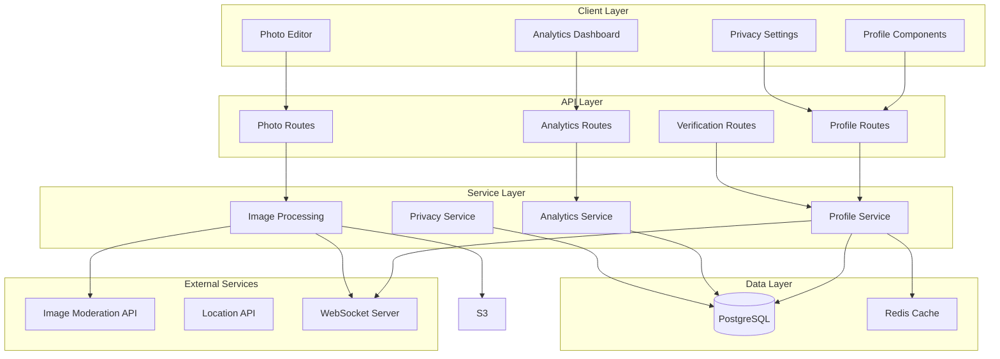

# Design Document

## Overview

The user profile system is a comprehensive feature that enables users to create, customize, and manage their personal profiles with extensive privacy controls. The system consists of frontend React components, backend API routes, database schema extensions, and cloud storage integration for media files. The design leverages the existing Next.js 16 App Router architecture, Prisma ORM with PostgreSQL, and Radix UI components for the interface.

The system is organized into five main functional areas:
1. **Profile Display & Editing** - Tabbed interface for viewing and editing profile information
2. **Photo Management** - Upload, crop, and manage profile and cover photos
3. **Privacy Controls** - Granular settings for controlling visibility of profile data
4. **Username & Verification** - Username change system with cooldown and verification badge management
5. **Analytics & Insights** - Profile performance metrics and audience demographics

## Architecture

### High-Level Architecture



### Technology Stack

- **Frontend**: React 19, Next.js 16 App Router, TypeScript, Tailwind CSS
- **UI Components**: Radix UI primitives, custom components in `components/ui/`
- **Forms**: React Hook Form with Zod validation
- **Rich Text**: TipTap editor (already in dependencies)
- **Image Processing**: Sharp (server-side), react-easy-crop (client-side)
- **Backend**: Next.js API Routes (App Router)
- **Database**: PostgreSQL with Prisma ORM
- **File Storage**: Local filesystem with organized directory structure (`public/uploads/profiles/` and `public/uploads/covers/`)
- **Caching**: In-memory cache (can be upgraded to Redis)
- **Real-time**: WebSocket for live updates (using existing infrastructure)
- **Location Data**: External geocoding API, only free and open sources, without any payments, like a open street map

### Data Flow

1. **Profile View Flow**:
   - User navigates to profile page → API fetches profile data with privacy rules applied → Components render with appropriate visibility
   
2. **Profile Edit Flow**:
   - User edits field → Client-side validation → Debounced save → API validates → Database update → Cache invalidation → WebSocket broadcast

3. **Photo Upload Flow**:
   - User selects photo → Client-side crop/resize → Upload to API → Image moderation check → Generate multiple sizes → Save to local storage → Update database → Return file URLs → Update UI

4. **Privacy Change Flow**:
   - User toggles privacy setting → Immediate UI feedback → API call → Database update → Cache invalidation → Affected viewers see updated visibility

## Components and Interfaces

### Frontend Components

#### 1. Profile Display Components

**ProfileHeader** (`components/profile/profile-header.tsx`)
- Displays profile photo (200x200), cover photo (1200x400), username, display name, location, joined date
- Shows follower/following/posts counts
- Hover overlays for photo changes (owner only)
- Verification badge display
- Profile completion badge

**ProfileEditPage** (`app/[locale]/profile/edit/page.tsx`)
- Container for tabbed editing interface
- Manages form state across all tabs
- Handles save/cancel actions
- Shows unsaved changes warning

**BasicInfoTab** (`components/profile/edit-tabs/basic-info-tab.tsx`)
- Full Name input with character counter (2-100 chars)
- Display Name input (1-50 chars, emoji support)
- Username input with real-time availability check
- Date of Birth picker with age calculation and visibility toggles
- Gender dropdown with custom option

**AboutMeTab** (`components/profile/edit-tabs/about-me-tab.tsx`)
- Rich text bio editor with TipTap
- Character counter (1000 chars)
- @mention autocomplete
- #hashtag autocomplete
- URL auto-detection and linking
- Emoji picker integration
- Interests multi-select with custom tags (max 30)
- Languages multi-select with proficiency levels

**ContactTab** (`components/profile/edit-tabs/contact-tab.tsx`)
- Email display with verification status
- Email change modal with password verification
- Phone number input with international format
- Phone verification with OTP
- Website URL input with validation
- Social media link inputs (Instagram, Twitter, TikTok, YouTube, Facebook)
- Country/State/City selectors with autocomplete
- Timezone selector with auto-detection

**PreferencesTab** (`components/profile/edit-tabs/preferences-tab.tsx`)
- Relationship status dropdown
- Additional preference fields
- Notification preferences
- Language preferences

**PrivacyTab** (`components/profile/edit-tabs/privacy-tab.tsx`)
- Profile visibility radio buttons
- Individual field privacy toggles
- Contact privacy controls
- Blocked accounts list
- Restricted accounts list

#### 2. Photo Management Components

**ProfilePhotoUpload** (`components/profile/profile-photo-upload.tsx`)
- Modal with upload options
- File picker integration
- Camera capture (mobile)
- Previous photos grid
- Remove photo option

**PhotoCropModal** (`components/profile/photo-crop-modal.tsx`)
- react-easy-crop integration
- Circular crop overlay for profile photos
- Rectangular crop for cover photos (3:1 ratio)
- Zoom slider (100%-300%)
- Rotation buttons (90° increments)
- Brightness/contrast adjustments
- Preview at multiple sizes
- Progress bar during upload

#### 3. Username & Verification Components

**UsernameChangeModal** (`components/profile/username-change-modal.tsx`)
- Username input with availability check
- Cooldown timer display
- Password verification
- Confirmation dialog with warnings

**VerificationRequestForm** (`components/profile/verification-request-form.tsx`)
- Multi-step form for verification request
- ID upload with preview
- Notability proof upload
- Business documents upload (optional)
- Submission status tracking

**VerificationBadge** (`components/profile/verification-badge.tsx`)
- Blue checkmark icon
- Tooltip with verification info
- Different badge types (verified, premium, etc.)

#### 4. Analytics Components

**ProfileAnalyticsDashboard** (`components/profile/analytics-dashboard.tsx`)
- Profile views chart (30-day line graph)
- Visitor statistics (unique vs returning)
- Referring sources breakdown
- Engagement metrics cards

**AudienceInsights** (`components/profile/audience-insights.tsx`)
- Follower demographics pie charts
- Age distribution chart
- Top locations map/list
- Follower growth line graph
- Best time to post heatmap

#### 5. Shared UI Components

**ProfileCompletionWidget** (`components/profile/profile-completion-widget.tsx`)
- Circular progress indicator
- Color-coded percentage (red/yellow/green)
- Checklist of incomplete items
- Clickable items to jump to sections

**MentionAutocomplete** (`components/profile/mention-autocomplete.tsx`)
- Dropdown triggered by @ symbol
- User search with profile photos
- Keyboard navigation
- Click to insert mention

**HashtagAutocomplete** (`components/profile/hashtag-autocomplete.tsx`)
- Dropdown triggered by # symbol
- Trending hashtags list
- Recent hashtags
- Click to insert hashtag

### Backend API Routes

#### Profile Routes

**GET /api/users/[userId]/profile**
- Fetches profile data with privacy rules applied
- Query params: `?fields=basic,contact,analytics` (optional field selection)
- Returns: Profile object with visible fields only
- Caches response for 5 minutes

**PUT /api/users/[userId]/profile**
- Updates profile fields
- Body: Partial profile object
- Validates: Authentication, field formats, uniqueness constraints
- Returns: Updated profile object
- Invalidates cache
- Broadcasts update via WebSocket

**GET /api/users/[userId]/profile/completion**
- Calculates profile completion percentage
- Returns: Completion object with percentage and missing fields

#### Photo Routes

**POST /api/users/[userId]/profile-photo**
- Uploads and processes profile photo
- Body: multipart/form-data with image file
- Validates: File type, size, content moderation
- Processes: Generates 5 size variants using Sharp
- Stores: Saves to local filesystem, updates database
- Returns: File URLs for all sizes

**DELETE /api/users/[userId]/profile-photo**
- Removes profile photo
- Generates default avatar with user's initials
- Moves old photo to archive directory for 30 days
- Returns: Default avatar URL

**POST /api/users/[userId]/cover-photo**
- Similar to profile-photo but for cover images
- Accepts larger files (max 15MB)
- Generates 4 size variants
- Maintains 3:1 aspect ratio
- Applies gradient overlay for text readability

**DELETE /api/users/[userId]/cover-photo**
- Removes cover photo
- Moves old photo to archive directory for 30 days
- Returns success status

#### Username Routes

**POST /api/users/[userId]/username/check**
- Checks username availability
- Body: `{ username: string }`
- Returns: `{ available: boolean, message?: string }`
- Debounced on client (300ms)

**POST /api/users/[userId]/username/change**
- Changes username with cooldown enforcement
- Body: `{ newUsername: string, password: string }`
- Validates: Password, availability, cooldown period
- Updates: Username, username_history table
- Returns: Success with new username

**GET /api/users/[userId]/username/history**
- Fetches username change history
- Returns: Array of previous usernames with timestamps

#### Verification Routes

**POST /api/users/[userId]/verification/request**
- Submits verification request
- Body: multipart/form-data with documents
- Validates: Eligibility (follower count >= 10,000)
- Stores: Documents in local filesystem, request in moderation queue
- Returns: Request ID and status

**GET /api/users/[userId]/verification/status**
- Checks verification request status
- Returns: Status object (pending/approved/rejected)

**POST /api/admin/verification/[requestId]/approve**
- Admin endpoint to approve verification
- Body: `{ notes?: string }`
- Updates: User verified status, sends notification
- Returns: Success

**POST /api/admin/verification/[requestId]/reject**
- Admin endpoint to reject verification
- Body: `{ reason: string }`
- Updates: Request status, sends notification
- Returns: Success

#### Analytics Routes

**GET /api/users/[userId]/analytics/views**
- Fetches profile view statistics
- Query params: `?period=30d` (7d, 30d, 90d, all)
- Returns: Time-series data for views

**GET /api/users/[userId]/analytics/engagement**
- Fetches engagement metrics
- Returns: Followers gained, messages, clicks, etc.

**GET /api/users/[userId]/analytics/audience**
- Fetches audience demographics
- Returns: Gender, age, location distributions

**POST /api/users/[userId]/analytics/track-view**
- Records a profile view
- Body: `{ referrer?: string }`
- Updates: View count, analytics data
- Returns: Success

#### Privacy Routes

**GET /api/users/[userId]/privacy**
- Fetches privacy settings
- Returns: Privacy configuration object

**PUT /api/users/[userId]/privacy**
- Updates privacy settings
- Body: Partial privacy object
- Validates: Valid privacy levels
- Returns: Updated privacy settings

**POST /api/users/[userId]/privacy/block**
- Blocks a user
- Body: `{ targetUserId: string }`
- Updates: Blocked users list
- Returns: Success

**POST /api/users/[userId]/privacy/unblock**
- Unblocks a user
- Body: `{ targetUserId: string }`
- Updates: Blocked users list
- Returns: Success

**POST /api/users/[userId]/privacy/restrict**
- Restricts a user (soft block)
- Body: `{ targetUserId: string }`
- Updates: Restricted users list
- Returns: Success

### Data Models

#### Database Schema Extensions

```prisma
model User {
  id                    String    @id @default(uuid())
  username              String    @unique
  email                 String    @unique
  emailVerified         Boolean   @default(false)
  phoneNumber           String?
  phoneVerified         Boolean   @default(false)
  
  // Basic Info
  fullName              String
  displayName           String?
  dateOfBirth           DateTime?
  showAge               Boolean   @default(false)
  showBirthYear         Boolean   @default(true)
  gender                String?
  customGender          String?
  
  // Profile Media
  profilePhotoUrl       String?
  coverPhotoUrl         String?
  
  // About
  bio                   String?
  interests             String[]
  languages             Json?     // [{ language: string, proficiency: string }]
  
  // Contact
  websiteUrl            String?
  socialLinks           Json?     // { instagram, twitter, tiktok, youtube, facebook }
  
  // Location
  country               String?
  state                 String?
  city                  String?
  timezone              String?
  
  // Preferences
  relationshipStatus    String?
  
  // Verification
  isVerified            Boolean   @default(false)
  verificationBadgeType String?
  verifiedAt            DateTime?
  
  // Profile Completion
  profileCompletion     Int       @default(0)
  
  // Timestamps
  joinedAt              DateTime  @default(now())
  lastActiveAt          DateTime?
  updatedAt             DateTime  @updatedAt
  
  // Relations
  privacySettings       UserPrivacySettings?
  usernameHistory       UsernameHistory[]
  verificationRequest   VerificationRequest?
  profileViews          ProfileView[]
  blockedUsers          BlockedUser[]       @relation("BlockedBy")
  blockedByUsers        BlockedUser[]       @relation("BlockedUser")
  restrictedUsers       RestrictedUser[]    @relation("RestrictedBy")
  restrictedByUsers     RestrictedUser[]    @relation("RestrictedUser")
  
  @@index([username])
  @@index([email])
  @@index([isVerified])
  @@map("users")
}

model UserPrivacySettings {
  id                    String   @id @default(uuid())
  userId                String   @unique
  user                  User     @relation(fields: [userId], references: [id], onDelete: Cascade)
  
  // Profile Visibility
  profileVisibility     String   @default("public") // public, friends, private, custom
  
  // Field Visibility
  profilePhotoVisibility String  @default("everyone") // everyone, friends, only_me
  coverPhotoVisibility  String   @default("everyone")
  emailVisibility       String   @default("only_me")
  phoneVisibility       String   @default("only_me")
  birthdayVisibility    String   @default("friends") // everyone, friends, only_me, hide_year
  ageVisibility         String   @default("friends")
  locationVisibility    String   @default("city") // exact, state, country, hidden
  joinedDateVisibility  String   @default("everyone")
  lastActiveVisibility  String   @default("friends")
  
  // Contact Privacy
  whoCanMessage         String   @default("everyone") // everyone, friends, friends_of_friends, following, no_one
  whoCanTag             String   @default("friends")
  friendsListVisibility String   @default("friends")
  followingListVisibility String @default("friends")
  likedPostsVisibility  String   @default("only_me")
  
  createdAt             DateTime @default(now())
  updatedAt             DateTime @updatedAt
  
  @@map("user_privacy_settings")
}

model UsernameHistory {
  id                    String   @id @default(uuid())
  userId                String
  user                  User     @relation(fields: [userId], references: [id], onDelete: Cascade)
  previousUsername      String
  newUsername           String
  changedAt             DateTime @default(now())
  
  @@index([userId])
  @@index([previousUsername])
  @@map("username_history")
}

model VerificationRequest {
  id                    String   @id @default(uuid())
  userId                String   @unique
  user                  User     @relation(fields: [userId], references: [id], onDelete: Cascade)
  
  fullLegalName         String
  reason                String
  idDocumentUrls        String[] // S3 URLs for ID photos
  notabilityProofUrls   String[] // S3 URLs for proof documents
  businessDocumentUrls  String[] // Optional business docs
  
  status                String   @default("pending") // pending, approved, rejected
  reviewedBy            String?
  reviewedAt            DateTime?
  rejectionReason       String?
  
  createdAt             DateTime @default(now())
  updatedAt             DateTime @updatedAt
  
  @@index([status])
  @@index([createdAt])
  @@map("verification_requests")
}

model ProfileView {
  id                    String   @id @default(uuid())
  profileUserId         String
  profileUser           User     @relation(fields: [profileUserId], references: [id], onDelete: Cascade)
  viewerUserId          String?  // Null for anonymous views
  viewerIpAddress       String?
  referrer              String?
  viewedAt              DateTime @default(now())
  
  @@index([profileUserId, viewedAt])
  @@index([viewerUserId])
  @@map("profile_views")
}

model BlockedUser {
  id                    String   @id @default(uuid())
  blockerId             String
  blocker               User     @relation("BlockedBy", fields: [blockerId], references: [id], onDelete: Cascade)
  blockedUserId         String
  blockedUser           User     @relation("BlockedUser", fields: [blockedUserId], references: [id], onDelete: Cascade)
  blockedAt             DateTime @default(now())
  
  @@unique([blockerId, blockedUserId])
  @@index([blockerId])
  @@index([blockedUserId])
  @@map("blocked_users")
}

model RestrictedUser {
  id                    String   @id @default(uuid())
  restricterId          String
  restricter            User     @relation("RestrictedBy", fields: [restricterId], references: [id], onDelete: Cascade)
  restrictedUserId      String
  restrictedUser        User     @relation("RestrictedUser", fields: [restrictedUserId], references: [id], onDelete: Cascade)
  restrictedAt          DateTime @default(now())
  
  @@unique([restricterId, restrictedUserId])
  @@index([restricterId])
  @@index([restrictedUserId])
  @@map("restricted_users")
}
```

#### TypeScript Interfaces

```typescript
// lib/types/profile.ts

export interface ProfileData {
  id: string
  username: string
  email?: string
  emailVerified: boolean
  phoneNumber?: string
  phoneVerified: boolean
  
  // Basic Info
  fullName: string
  displayName?: string
  dateOfBirth?: string
  showAge: boolean
  showBirthYear: boolean
  age?: number
  gender?: string
  customGender?: string
  
  // Profile Media
  profilePhotoUrl?: string
  profilePhotoUrls?: {
    original: string
    large: string
    medium: string
    small: string
    thumbnail: string
  }
  coverPhotoUrl?: string
  coverPhotoUrls?: {
    original: string
    large: string
    medium: string
    small: string
  }
  
  // About
  bio?: string
  interests: string[]
  languages?: Array<{
    language: string
    proficiency: 'native' | 'fluent' | 'conversational' | 'basic' | 'learning'
  }>
  
  // Contact
  websiteUrl?: string
  socialLinks?: {
    instagram?: string
    twitter?: string
    tiktok?: string
    youtube?: string
    facebook?: string
  }
  
  // Location
  country?: string
  state?: string
  city?: string
  timezone?: string
  
  // Preferences
  relationshipStatus?: string
  
  // Verification
  isVerified: boolean
  verificationBadgeType?: string
  verifiedAt?: string
  
  // Profile Completion
  profileCompletion: number
  
  // Stats
  followersCount: number
  followingCount: number
  postsCount: number
  
  // Timestamps
  joinedAt: string
  lastActiveAt?: string
  updatedAt: string
}

export interface PrivacySettings {
  profileVisibility: 'public' | 'friends' | 'private' | 'custom'
  profilePhotoVisibility: 'everyone' | 'friends' | 'only_me'
  coverPhotoVisibility: 'everyone' | 'friends' | 'only_me'
  emailVisibility: 'everyone' | 'friends' | 'only_me' | 'never'
  phoneVisibility: 'everyone' | 'friends' | 'only_me' | 'never'
  birthdayVisibility: 'everyone' | 'friends' | 'only_me' | 'hide_year'
  ageVisibility: 'everyone' | 'friends' | 'only_me'
  locationVisibility: 'exact' | 'state' | 'country' | 'hidden'
  joinedDateVisibility: 'everyone' | 'friends' | 'only_me'
  lastActiveVisibility: 'everyone' | 'friends' | 'only_me' | 'hidden'
  whoCanMessage: 'everyone' | 'friends' | 'friends_of_friends' | 'following' | 'no_one'
  whoCanTag: 'everyone' | 'friends' | 'only_me' | 'no_one'
  friendsListVisibility: 'everyone' | 'friends' | 'only_me'
  followingListVisibility: 'everyone' | 'friends' | 'only_me'
  likedPostsVisibility: 'everyone' | 'friends' | 'only_me'
}

export interface ProfileAnalytics {
  views: {
    total: number
    unique: number
    returning: number
    byDay: Array<{ date: string; count: number }>
  }
  referrers: Array<{ source: string; count: number }>
  engagement: {
    followersGainedWeek: number
    followersGainedMonth: number
    messagesReceived: number
    profilePhotoViews: number
    coverPhotoViews: number
    bioLinkClicks: number
    websiteClicks: number
    socialLinkClicks: Record<string, number>
  }
  audience: {
    genderDistribution: Record<string, number>
    ageDistribution: Record<string, number>
    topLocations: Array<{ location: string; count: number }>
    followerGrowth: Array<{ date: string; count: number }>
    bestTimeToPost: number[][] // 24x7 heatmap
  }
}

export interface UsernameChangeRequest {
  newUsername: string
  password: string
}

export interface UsernameAvailability {
  available: boolean
  message?: string
}

export interface VerificationRequestData {
  fullLegalName: string
  reason: string
  idDocuments: File[]
  notabilityProof: File[]
  businessDocuments?: File[]
}
```

### Form Validation Design

**Validation Strategy:**
- Client-side validation using Zod schemas
- Real-time validation on blur (not on every keystroke)
- Server-side validation as final check
- Consistent error messages between client and server

**Validation Rules:**
- **Full Name**: 2-100 characters, letters only (plus hyphens, apostrophes, spaces)
- **Display Name**: 1-50 characters, any Unicode characters including emojis
- **Username**: 3-20 characters, alphanumeric plus underscore/hyphen, must start with letter
- **Email**: Valid email format, unique in database
- **Phone**: Valid international format with country code
- **Website**: Valid URL with http/https protocol
- **Bio**: 1000 characters max, max 10 hashtags
- **Date of Birth**: Must be 13+ years old
- **Social Links**: Platform-specific format validation

**Error Display:**
- Inline errors below fields with red text and icon
- Red border on invalid fields
- Error summary at top of form for multiple errors
- Success messages with green checkmark
- Loading states during async validation

**Debouncing:**
- Username availability: 300ms debounce
- Email availability: 500ms debounce
- Location autocomplete: 300ms debounce
- Prevents excessive API calls

**Design Rationale:**
- Zod provides type-safe validation with TypeScript
- Real-time feedback improves user experience
- Server-side validation prevents malicious bypasses
- Debouncing reduces server load
- Consistent error messages reduce confusion

## Error Handling

### Client-Side Error Handling

1. **Form Validation Errors**
   - Display inline error messages below fields
   - Highlight invalid fields with red border
   - Prevent form submission until errors are resolved
   - Use Zod schemas for validation

2. **Network Errors**
   - Show toast notification for failed API calls
   - Retry mechanism for transient failures (3 attempts)
   - Offline detection with appropriate messaging
   - Queue actions for retry when connection restored

3. **Upload Errors**
   - File size exceeded: "File too large. Maximum size is 10MB"
   - Invalid file type: "Please upload a valid image file (JPEG, PNG, WebP, HEIC)"
   - Moderation failure: "This image cannot be uploaded. Please choose a different photo"
   - Upload timeout: Retry with exponential backoff

### Server-Side Error Handling

1. **Authentication Errors**
   - 401 Unauthorized: User not authenticated
   - 403 Forbidden: User not authorized to access/modify resource
   - Return appropriate error messages

2. **Validation Errors**
   - 400 Bad Request: Invalid input data
   - Return detailed validation errors with field names
   - Example: `{ field: 'username', message: 'Username already taken' }`

3. **Rate Limiting**
   - 429 Too Many Requests: Rate limit exceeded
   - Return retry-after header
   - Username changes: Enforce 30-day cooldown

4. **External Service Errors**
   - S3 upload failure: Retry with exponential backoff, fallback to local storage
   - Image moderation API failure: Log error, allow upload (manual review later)
   - Location API failure: Allow manual text entry

5. **Database Errors**
   - Unique constraint violation: Return user-friendly message
   - Connection errors: Retry with exponential backoff
   - Transaction failures: Rollback and return error

## Testing Strategy

### Unit Tests

1. **Component Tests** (Jest + React Testing Library)
   - Test each profile component in isolation
   - Mock API calls and external dependencies
   - Test form validation logic
   - Test privacy visibility logic
   - Test photo cropping calculations
   - Coverage target: 80%

2. **Service Tests**
   - Test profile service methods
   - Test image processing functions
   - Test privacy rule application
   - Test analytics calculations
   - Mock database and external services

3. **Validation Tests**
   - Test Zod schemas for all input types
   - Test edge cases (empty strings, special characters, etc.)
   - Test length limits and format requirements

### Integration Tests

1. **API Route Tests**
   - Test each API endpoint with various inputs
   - Test authentication and authorization
   - Test error responses
   - Test rate limiting
   - Use test database

2. **Database Tests**
   - Test Prisma queries and mutations
   - Test transactions and rollbacks
   - Test cascade deletes
   - Test indexes and performance

3. **File Upload Tests**
   - Test local filesystem upload flow
   - Test image processing pipeline with Sharp
   - Test moderation integration
   - Use test upload directory that's cleaned after tests

### End-to-End Tests

1. **Profile Editing Flow** (Playwright)
   - Navigate to profile edit page
   - Fill out all tabs
   - Save changes
   - Verify data persisted
   - Verify UI updates

2. **Photo Upload Flow**
   - Upload profile photo
   - Crop and adjust
   - Verify upload success
   - Verify photo displays correctly
   - Verify multiple sizes generated

3. **Username Change Flow**
   - Attempt username change
   - Verify cooldown enforcement
   - Complete username change
   - Verify redirect from old username

4. **Privacy Settings Flow**
   - Change privacy settings
   - Verify visibility changes
   - Test as different user types (public, friend, blocked)

5. **Verification Request Flow**
   - Submit verification request
   - Upload documents
   - Verify request in admin queue
   - Approve/reject as admin
   - Verify badge appears

### Performance Tests

1. **Load Testing**
   - Test profile page load time (target: < 1s)
   - Test API response times (target: < 200ms)
   - Test image upload time (target: < 5s for 10MB)
   - Test concurrent users (target: 1000 simultaneous)

2. **Database Performance**
   - Test query performance with large datasets
   - Test index effectiveness
   - Test cache hit rates

3. **Image Processing Performance**
   - Test Sharp processing time for various sizes
   - Test concurrent image uploads
   - Test CDN cache effectiveness

### Security Tests

1. **Authentication Tests**
   - Test unauthorized access attempts
   - Test token expiration
   - Test CSRF protection

2. **Authorization Tests**
   - Test accessing other users' private data
   - Test modifying other users' profiles
   - Test privacy rule enforcement

3. **Input Validation Tests**
   - Test SQL injection attempts
   - Test XSS attempts in bio/text fields
   - Test file upload exploits
   - Test path traversal attempts

4. **Rate Limiting Tests**
   - Test API rate limits
   - Test username change cooldown
   - Test brute force protection

### Profile Completion System Design

**Completion Calculation:**
```typescript
function calculateProfileCompletion(user: User): number {
  const weights = {
    profilePhoto: 10,
    coverPhoto: 5,
    bio: 15,
    location: 5,
    birthday: 5,
    phoneVerified: 10,
    emailVerified: 10,
    interests: 10,
    hasPet: 20,
    contactInfo: 5,
    socialLinks: 5
  }
  
  let score = 0
  if (user.profilePhotoUrl) score += weights.profilePhoto
  if (user.coverPhotoUrl) score += weights.coverPhoto
  if (user.bio && user.bio.length >= 50) score += weights.bio
  if (user.city) score += weights.location
  if (user.dateOfBirth) score += weights.birthday
  if (user.phoneVerified) score += weights.phoneVerified
  if (user.emailVerified) score += weights.emailVerified
  if (user.interests.length >= 3) score += weights.interests
  if (user.pets.length >= 1) score += weights.hasPet
  if (user.websiteUrl || user.phoneNumber) score += weights.contactInfo
  if (Object.keys(user.socialLinks || {}).length >= 1) score += weights.socialLinks
  
  return score
}
```

**Completion Widget:**
- Circular progress indicator using SVG or CSS
- Color coding:
  - Red (0-30%): "Get started on your profile"
  - Yellow (31-60%): "You're making progress!"
  - Green (61-100%): "Looking good!" or "Profile complete!"
- Checklist of incomplete items with icons
- Each item clickable to jump to relevant section

**Profile Strength Badge:**
- Bronze (0-30%): Basic profile
- Silver (31-60%): Developing profile
- Gold (61-85%): Strong profile
- Platinum (86-100%): Complete profile
- Display as small icon next to username on public profile

**Motivational Messaging:**
- "Complete your profile to get more visibility"
- "Profiles with photos get 10x more views"
- "Add interests to connect with like-minded pet lovers"
- Update messages based on what's missing

**Design Rationale:**
- Weighted scoring prioritizes important fields
- Visual progress indicator motivates completion
- Gamification (badges) encourages engagement
- Clickable checklist reduces friction
- Higher completion correlates with better user experience

## Implementation Notes

### Phase 1: Core Profile System
- Database schema and migrations
- Basic profile display and editing
- Form validation
- API routes for CRUD operations

### Phase 2: Photo Management
- Photo upload and cropping
- Local filesystem storage integration
- Image processing pipeline with Sharp
- Next.js Image Optimization setup

### Phase 3: Privacy Controls
- Privacy settings UI
- Privacy rule enforcement
- Blocking and restricting

### Phase 4: Advanced Features
- Username change system
- Verification system
- Profile analytics
- Real-time updates

### Local Storage Implementation

**Directory Structure:**
```
public/
  uploads/
    profiles/
      {userId}/
        original.{ext}
        large.{ext}
        medium.{ext}
        small.{ext}
        thumbnail.{ext}
    covers/
      {userId}/
        original.{ext}
        large.{ext}
        medium.{ext}
        small.{ext}
    verification/
      {userId}/
        id-{timestamp}.{ext}
        proof-{timestamp}.{ext}
    archive/
      profiles/
        {userId}-{timestamp}.{ext}
      covers/
        {userId}-{timestamp}.{ext}
```

**Storage Service Design:**
- Create `lib/storage/local-storage.ts` with methods: `uploadProfilePhoto()`, `uploadCoverPhoto()`, `deletePhoto()`, `getPhotoUrl()`, `archivePhoto()`
- Use UUID-based filenames to prevent enumeration attacks
- Implement atomic file operations (write to temp, then move)
- Set appropriate file permissions (readable by web server only)
- Implement cleanup for orphaned files (photos not referenced in database)
- Create backup/archive directory for deleted photos (30-day retention)
- Implement scheduled cleanup job to remove archived files after 30 days

**URL Generation:**
- Profile photos: `/uploads/profiles/{userId}/{size}.{ext}`
- Cover photos: `/uploads/covers/{userId}/{size}.{ext}`
- Use Next.js Image component for automatic optimization and caching
- Implement fallback to default avatars when photos don't exist
- Generate default avatars with user initials using canvas or SVG

**Design Rationale:**
- Local storage chosen for simplicity and to avoid external service dependencies
- Can be migrated to cloud storage (S3, Cloudinary) later if needed
- Next.js Image Optimization provides caching and format conversion
- Archive directory allows recovery of accidentally deleted photos

### Username Change System Design

**Cooldown Enforcement:**
- Store `lastUsernameChangeAt` timestamp in User model
- Calculate days remaining: `30 - daysSince(lastUsernameChangeAt)`
- Block change requests if cooldown period hasn't elapsed
- Display countdown timer in UI showing days/hours remaining

**Username History Tracking:**
- UsernameHistory table stores: `userId`, `previousUsername`, `newUsername`, `changedAt`
- Maintain complete audit trail of all username changes
- Allow users to view their own history
- Allow admins to view any user's history

**Old Username Redirect Logic:**
- For 30 days after change, redirect old username URLs to new username
- Display banner: "This user recently changed their username from @oldname to @newname"
- After 30 days, release old username for others to claim
- Implement middleware to check username_history table for redirects

**Username Availability:**
- Check current usernames in User table
- Check reserved/blocked usernames list
- Check usernames in cooldown period (last 30 days in history)
- Debounce availability checks (300ms) to reduce database load

**Design Rationale:**
- 30-day cooldown prevents username squatting and confusion
- History tracking provides accountability and audit trail
- Temporary redirects help followers find users after name change
- Password verification prevents unauthorized changes

### Verification System Design

**Eligibility Requirements:**
- Minimum 10,000 followers
- Email and phone must be verified
- Account must be at least 90 days old
- No active violations or warnings

**Verification Request Flow:**
1. User submits request with documents
2. System validates eligibility
3. Documents uploaded to secure storage
4. Request added to admin moderation queue
5. Admin reviews documents and profile
6. Admin approves or rejects with reason
7. User notified via email
8. If approved, badge appears immediately

**Document Requirements:**
- Government-issued ID (front and back)
- Proof of notability (news articles, social media verification, etc.)
- Business documents (optional, for organizations)
- All documents stored securely with restricted access

**Badge Display:**
- Blue checkmark icon next to username
- Tooltip: "Verified account"
- Displayed consistently across all UI components
- Cannot be removed except by admin

**Rejection Handling:**
- User can resubmit after 90 days
- Rejection reason provided to help user improve application
- Multiple rejections may result in permanent ineligibility

**Design Rationale:**
- Manual review ensures quality and prevents abuse
- Document requirements verify identity and notability
- 90-day resubmission cooldown prevents spam
- Follower threshold ensures only notable accounts are verified

### Performance Optimizations

1. **Caching Strategy**
   - Cache profile data for 5 minutes using in-memory cache
   - Invalidate on updates
   - Use Redis for distributed caching (optional upgrade for multi-server deployments)
   - Cache photo URLs indefinitely (only change when photos are updated)
   - Leverage Next.js automatic image caching

2. **Database Optimizations**
   - Add indexes on frequently queried fields
   - Use database-level caching
   - Optimize N+1 queries with includes
   - Use connection pooling

3. **Image Optimizations**
   - Generate multiple sizes on upload
   - Use WebP format for modern browsers with JPEG fallback
   - Lazy load images below the fold
   - Serve images from local filesystem via Next.js Image Optimization
   - Implement progressive image loading with blur placeholders
   - Use Next.js Image component for automatic optimization

4. **API Optimizations**
   - Implement field selection (only return requested fields via query params)
   - Use cursor-based pagination for lists
   - Compress responses with gzip/brotli
   - Implement ETag caching for profile data
   - Use HTTP 304 Not Modified responses when appropriate

### Analytics Tracking System Design

**Profile View Tracking:**
- Record view when profile page loads
- Capture: viewer ID (if authenticated), IP address, referrer, timestamp
- Deduplicate views within 24-hour window per viewer
- Track unique vs returning visitors
- Store in ProfileView table for historical analysis

**Engagement Metrics:**
- Track clicks on: profile photo, cover photo, bio links, website, social links
- Count messages sent to user
- Track follower growth over time
- Calculate engagement rate: (interactions / views) * 100

**Audience Demographics:**
- Aggregate follower data: gender, age range, location
- Calculate distributions and percentages
- Track follower growth trends
- Identify peak activity times for "best time to post"

**Privacy Considerations:**
- Only profile owner can view their analytics
- Anonymous views tracked by IP (hashed for privacy)
- No personally identifiable information exposed
- Aggregate data only (no individual viewer details)

**Performance Optimization:**
- Use background jobs for analytics calculations
- Cache analytics data for 1 hour
- Pre-calculate daily/weekly/monthly aggregates
- Use database indexes on timestamp fields

**Design Rationale:**
- Analytics help users optimize their profile and content
- Privacy-first approach protects viewer information
- Caching reduces database load for popular profiles
- Background jobs prevent analytics from slowing page loads

### Security Considerations

1. **Data Protection**
   - Encrypt sensitive data at rest
   - Use HTTPS for all communications
   - Sanitize all user inputs
   - Implement CSRF protection

2. **Privacy Enforcement**
   - Apply privacy rules at database query level
   - Never expose private data in API responses
   - Log all privacy-sensitive operations
   - Implement audit trail

3. **File Upload Security**
   - Validate file types using MIME type checking and magic number verification
   - Validate file sizes (10MB for profile photos, 15MB for cover photos)
   - Scan for malware using ClamAV or similar (optional)
   - Use content moderation API to detect inappropriate content
   - Store files with UUID-based random names to prevent enumeration
   - Sanitize filenames to prevent path traversal attacks
   - Implement rate limiting on upload endpoints

4. **Rate Limiting**
   - Implement per-user rate limits
   - Implement per-IP rate limits
   - Use exponential backoff for retries
   - Monitor for abuse patterns

### Rich Text Editor Design

**TipTap Integration:**
- Use TipTap with extensions: Bold, Italic, Underline, Strike, BulletList, OrderedList, Link, Emoji
- Custom extensions for @mentions and #hashtags
- Character counter extension with 1000 character limit
- Placeholder text: "Tell us about yourself..."

**Mention System:**
- Trigger on @ symbol
- Search followers and friends by username/display name
- Display dropdown with profile photos and usernames
- Keyboard navigation (up/down arrows, enter to select)
- Insert as link: `<a href="/user/{username}" class="mention">@{username}</a>`
- Highlight mentions in blue (#3B82F6)
- Clicking mention navigates to user profile

**Hashtag System:**
- Trigger on # symbol
- Show trending hashtags and user's recent hashtags
- Auto-link hashtags: `<a href="/search?q=%23{tag}" class="hashtag">#{tag}</a>`
- Limit to 10 hashtags per bio
- Validate hashtag format (alphanumeric, no spaces)
- Highlight hashtags in blue (#3B82F6)

**URL Auto-Detection:**
- Detect URLs with regex pattern
- Validate http/https protocol
- Convert to clickable links with `target="_blank" rel="noopener noreferrer"`
- Truncate display text to domain + "..." for long URLs
- Show full URL on hover

**Emoji Picker:**
- Use emoji-picker-react or similar library
- Categorized emoji grid (Smileys, Animals, Food, etc.)
- Search functionality
- Recently used emojis
- Insert at cursor position

**Design Rationale:**
- TipTap provides extensible, accessible rich text editing
- Mentions create social connections and notifications
- Hashtags enable content discovery
- URL auto-linking improves user experience
- Character limit prevents overly long bios

### Accessibility

1. **Keyboard Navigation**
   - All interactive elements keyboard accessible
   - Logical tab order
   - Focus indicators visible
   - Skip links for long forms

2. **Screen Reader Support**
   - Semantic HTML elements
   - ARIA labels for custom components
   - Alt text for all images
   - Form labels properly associated

3. **Visual Accessibility**
   - Sufficient color contrast (WCAG AA)
   - Text resizable up to 200%
   - No information conveyed by color alone
   - Focus indicators visible

4. **Error Handling**
   - Clear error messages
   - Error summaries at top of forms
   - Inline validation feedback
   - Success confirmations

### Privacy System Design

**Privacy Rule Application:**
- Apply privacy rules at query level (filter before returning data)
- Never expose private data in API responses
- Check viewer's relationship to profile owner: self, friend, follower, blocked, restricted, stranger
- Use privacy settings to determine field visibility

**Relationship Determination:**
- Self: viewer.id === profile.id
- Friend: mutual follow relationship
- Follower: viewer follows profile owner
- Blocked: profile owner has blocked viewer
- Restricted: profile owner has restricted viewer
- Stranger: no relationship

**Field Visibility Logic:**
```typescript
function isFieldVisible(field: string, privacy: PrivacySettings, relationship: Relationship): boolean {
  const fieldPrivacy = privacy[`${field}Visibility`]
  
  if (relationship === 'self') return true
  if (relationship === 'blocked') return false
  
  switch (fieldPrivacy) {
    case 'everyone': return true
    case 'friends': return relationship === 'friend'
    case 'only_me': return false
    case 'never': return false
    default: return false
  }
}
```

**Blocking vs Restricting:**
- **Blocking**: Complete prevention of interaction
  - Blocked user cannot view profile
  - Blocked user cannot send messages
  - Blocked user cannot see posts
  - Blocked user is not notified
  
- **Restricting**: Soft block with hidden effects
  - Restricted user can view profile
  - Restricted user's comments hidden from others
  - Restricted user's comments visible to them (they don't know)
  - Profile owner can approve individual comments
  - Restricted user is not notified

**Privacy Setting Changes:**
- Save immediately via AJAX
- Show loading spinner during save
- Show success checkmark on completion
- Invalidate cached profile data
- Broadcast privacy change event (for real-time updates)

**Design Rationale:**
- Query-level filtering prevents accidental data exposure
- Relationship-based visibility provides granular control
- Blocking prevents harassment and unwanted contact
- Restricting allows subtle management of problematic users
- Immediate saves provide responsive user experience

### Internationalization

1. **Text Content**
   - All UI text in translation files
   - Support for RTL languages
   - Date/time formatting per locale
   - Number formatting per locale

2. **Input Validation**
   - Support international characters in names
   - Support international phone formats
   - Support international addresses
   - Timezone-aware date handling

3. **Content**
   - Bio supports Unicode and emojis
   - Username supports international characters (with restrictions)
   - Location data in multiple languages
